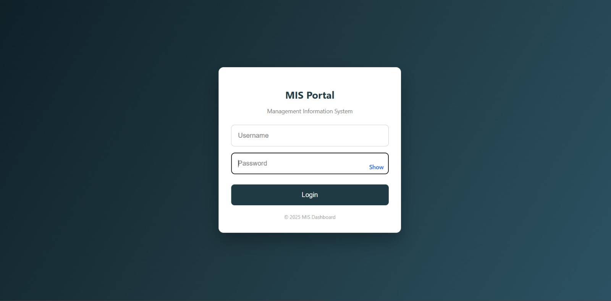
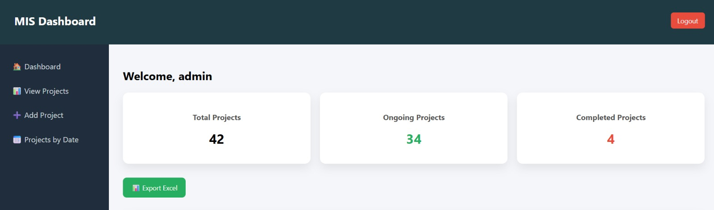
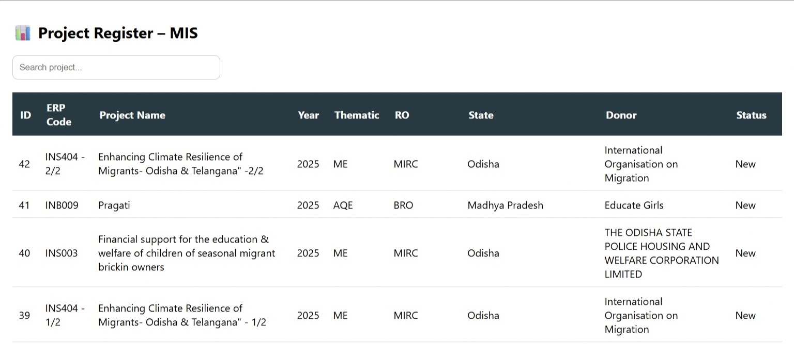
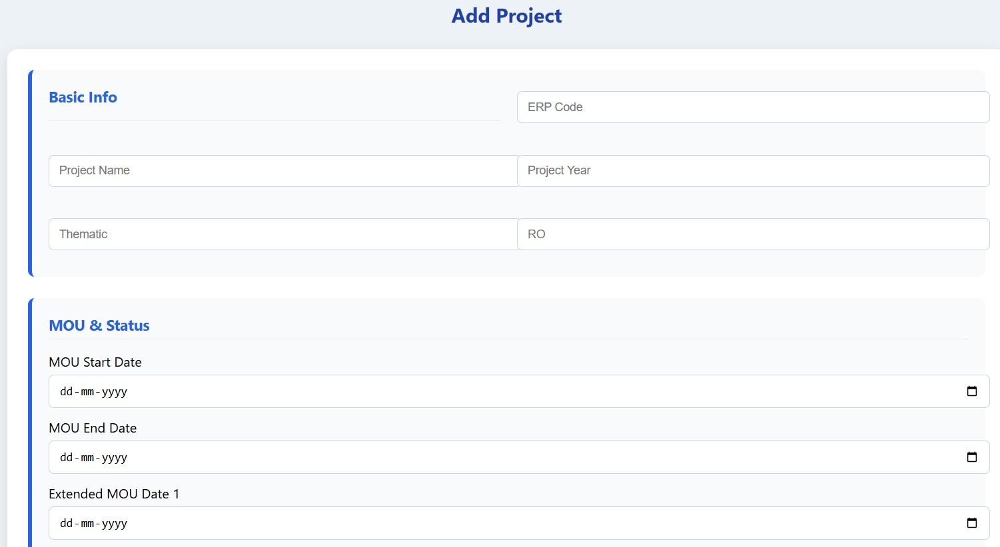

# 🌍 NGO Project Management System
## 🚀 Full-Stack MIS Platform for NGOs & Social Impact Organizations

<div align="center">


### 📊 A Modern NGO MIS Dashboard for Managing Projects, Resources & Organizational Operations

</div>

---

# 📌 About The Project

Managing NGO projects manually using spreadsheets and disconnected systems often leads to:

- ❌ Poor visibility into project progress  
- ❌ Resource mismanagement  
- ❌ Delays in reporting and monitoring  
- ❌ Inefficient communication  
- ❌ Difficulty handling multiple projects simultaneously  

To solve these challenges, this project introduces a **centralized NGO Project Management & MIS Platform** developed using **Flask** and **MySQL**.

The system enables NGOs and development organizations to efficiently:

✔️ Manage projects  
✔️ Track progress  
✔️ Monitor project timelines  
✔️ Handle resource allocation  
✔️ Generate operational insights through dashboards  

---

# ✨ Key Features

## 📊 Interactive MIS Dashboard
- Real-time project overview
- Project statistics and summaries
- Ongoing & completed project tracking

## 📁 Project Management
- Add and manage NGO projects
- Track thematic areas and project regions
- Maintain centralized records

## 🔍 Smart Project Register
- Search projects instantly
- Filter and monitor project status
- View donor and project information

## 📅 MOU & Timeline Tracking
- Manage project start/end dates
- Track extended MOU periods
- Improve project planning

## 📤 Export Functionality
- Export project reports to Excel
- Simplify reporting and documentation

## 🔐 Secure Login System
- User authentication
- Protected administrative access

---

# 🧠 System Architecture

```text
┌─────────────────────────┐
│     Frontend Layer      │
│  HTML • CSS • JavaScript│
└────────────┬────────────┘
             │
             ▼
┌─────────────────────────┐
│      Flask Backend      │
│   Business Logic Layer  │
└────────────┬────────────┘
             │
             ▼
┌─────────────────────────┐
│      MySQL Database     │
│   Data Storage Layer    │
└─────────────────────────┘
```

---

# 🖼️ Application Screenshots

# 🔐 Login Page

Secure authentication system for NGO administrators and users.



---

# 📊 MIS Dashboard

Centralized dashboard displaying:

- Total Projects
- Ongoing Projects
- Completed Projects
- Excel Export Functionality



---

# 📁 Project Register

Project register module for managing and searching all NGO projects efficiently.

### Features:
- Search functionality
- Donor tracking
- State-wise project monitoring
- Status management



---

# ➕ Add Project Module

Comprehensive form for creating and managing NGO projects.

### Includes:
- ERP Code
- Project Name
- Year
- Thematic Area
- RO Details
- MOU Dates
- Status Tracking



---

# 🚀 Core Functionalities

| Module | Description |
|---|---|
| 📊 Dashboard | Real-time NGO analytics & summaries |
| 📁 Project Register | Centralized project monitoring |
| ➕ Add Project | Project creation & data management |
| 📅 Timeline Tracking | MOU and extension monitoring |
| 👥 Resource Management | Resource allocation & planning |
| 📤 Excel Export | Report generation |

---

# 🛠️ Technology Stack

## 💻 Frontend
- HTML5
- CSS3
- JavaScript

## ⚙️ Backend
- Python
- Flask Framework

## 🗄️ Database
- MySQL

## 🔧 Tools & Version Control
- Git
- GitHub

---

# 📂 Project Structure

```bash
ngo-management-system/
│
├── static/
│   ├── css/
│   ├── js/
│   ├── images/
│
├── templates/
│
├── app.py
├── config.py
├── requirements.txt
└── README.md
```

---

# ⚙️ Installation & Setup Guide

## 1️⃣ Clone the Repository

```bash
git clone https://github.com/Janicebenita/Full-Stack-NGO-Management-Platform-with-Dashboard-and-Resource-Allocation.git
```

---

## 2️⃣ Navigate to Project Folder

```bash
cd Full-Stack-NGO-Management-Platform-with-Dashboard-and-Resource-Allocation
```

---

## 3️⃣ Install Dependencies

```bash
pip install -r requirements.txt
```

---

## 4️⃣ Configure MySQL Database

Create a MySQL database and update your credentials in:

```python
config.py
```

Example:

```python
MYSQL_HOST = 'localhost'
MYSQL_USER = 'root'
MYSQL_PASSWORD = 'your_password'
MYSQL_DB = 'ngo_management'
```

---

## 5️⃣ Run the Flask Application

```bash
python app.py
```

---

## 6️⃣ Open in Browser

```text
http://127.0.0.1:5000
```

---

# 🎯 Project Objectives

✔️ Centralize NGO project management  
✔️ Improve project monitoring and visibility  
✔️ Reduce manual administrative tasks  
✔️ Enable data-driven decision-making  
✔️ Streamline organizational workflows  

---

# 🔮 Future Enhancements

- 📈 Advanced Analytics Dashboard
- 👤 Role-Based Access Control
- 📧 Email Notifications
- ☁️ Cloud Deployment
- 📱 Mobile Responsive UI
- 📎 Document Upload & Management
- 📊 PDF Report Generation

---

# 🤝 Contribution Guidelines

Contributions are welcome!

## Steps:
1. Fork the repository  
2. Create a new branch  
3. Commit your changes  
4. Push to GitHub  
5. Create a Pull Request  

---

# ⭐ Support This Project

If you found this project useful:

🌟 Star the repository  
🍴 Fork the project  
💡 Share your feedback  
🤝 Contribute improvements  

---

# 👩‍💻 Developer

## Janice Benita

- 💼 LinkedIn: https://linkedin.com/in/janice13
- 💻 GitHub: https://github.com/Janicebenita
- 📧 Email: janicebenita123@gmail.com

---

# 📜 License

This project is developed for educational and organizational management purposes.

---

<div align="center">

## 🌍 Empowering NGOs Through Technology

### Built with ❤️ using Flask & MySQL

</div>
